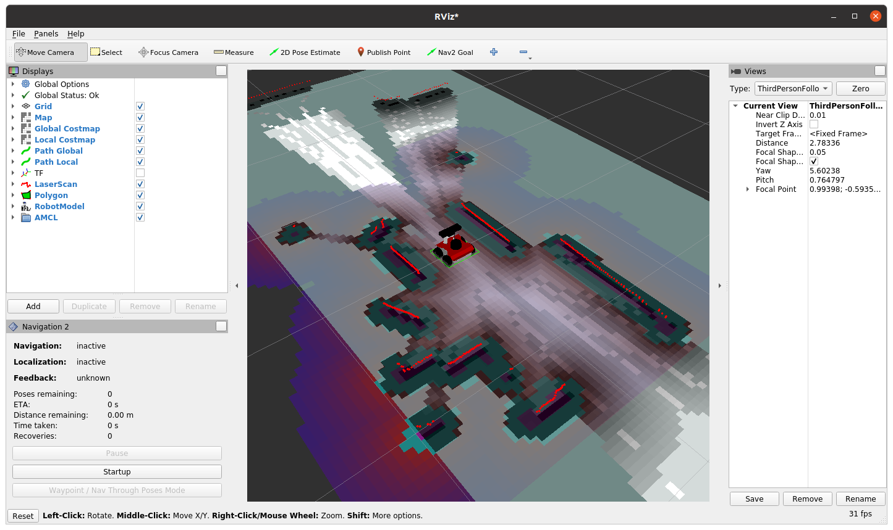
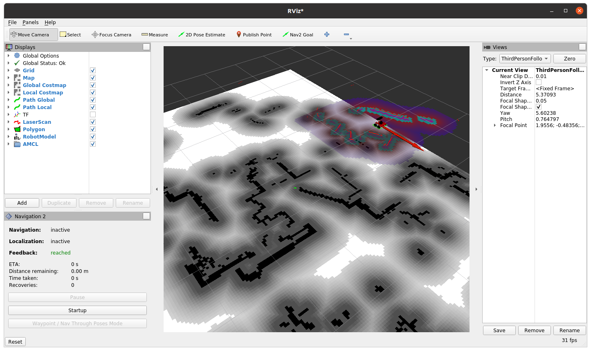
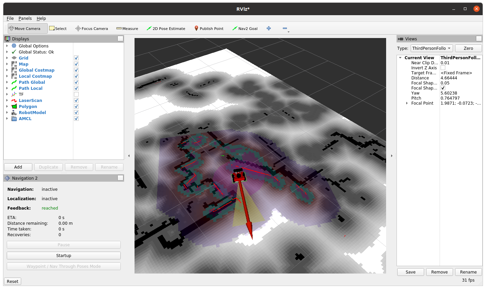

# Demo

Docker Compose yaml configurations from this folder present how to run autonomous mapping and navigation demo with ROSbot [Navigation2](https://navigation.ros.org/) and [Slam Toolbox](http://wiki.ros.org/slam_toolbox). 

There are two phases:

1. **Creating a map** - navigation and creating a map by using [slam-toolbox](https://github.com/SteveMacenski/slam_toolbox)
2. **Localization on an already created map** - Navigation based on created map - with [AMCL](https://navigation.ros.org/configuration/packages/configuring-amcl.html)

Both cases are presented in three setups: 

1. In a Local Area Network (LAN) - the robot running navigation stack and PC / laptop running RViz are in the same Wi-Fi network.
2. Over the Internet (VPN) - the robot and the laptop can be in separate networks.
3. Gazebo simulation.

> **Prerequisites**
>
> Make sure you have [Docker and Docker-Compose](https://docs.docker.com/desktop/install/linux-install/) installed on your laptop. 
> 
> If you don't have, here's a quick summary for Ubuntu 20.04 (just click the `copy` button, and paste it to the Linux terminal):
> ```bash
> sudo apt-get update && sudo apt-get install -y ca-certificates curl gnupg lsb-release
> ```
> ```bash
> sudo mkdir -p /etc/apt/keyrings
> ```
> ```bash
> curl -fsSL https://download.docker.com/linux/ubuntu/gpg | sudo gpg --dearmor -o /etc/apt/keyrings/docker.gpg
> ```
> ```bash
> echo \
>  "deb [arch=$(dpkg --print-architecture) signed-by=/etc/apt/keyrings/docker.gpg] https://download.docker.com/linux/ubuntu \
>  $(lsb_release -cs) stable" | sudo tee /etc/apt/sources.list.d/docker.list > /dev/null
> ```
> ```bash
> sudo apt-get update && sudo apt-get install -y docker-ce docker-ce-cli containerd.io docker-compose-plugin
> ```
>
> Change `/var/run/docker.sock` permissions, so every user can can run docker commands without `sudo`:
> ```bash
> sudo chmod 666 /var/run/docker.sock
> ```

## Quick start (with a physical ROSbot)

### 1. Clone this repo **on your laptop**

```bash
git clone https://github.com/husarion/rosbot-docker/
```

### 2. Prepare `demo/.env` file

```bash
cd rosbot-docker/demo
cp .env.template .env
```

modify it if needed (see comments)

> **Warning**
>
> Make sure you have Docker Compose with at least `v2.3.0` version installed on your PC/laptop
>
> ```bash
> $ docker compose version
> Docker Compose version v2.3.3
> ```
>
> Inline comments in `.env` files are supported from this version

```bash
# ======================================================
# SBC <> STM32 serial connection.
# ======================================================

# SERIAL_PORT=/dev/ttyS1     # ROSbot 2
# SERIAL_PORT=/dev/ttyS4     # ROSbot 2 PRO
SERIAL_PORT=/dev/ttyAMA0   # ROSbbot 2R

# ======================================================
# Serial baudrate for rplidar driver
# ======================================================

RPLIDAR_BAUDRATE=115200     # RPLIDAR A2
# RPLIDAR_BAUDRATE=256000     # RPLIDAR A3

# ======================================================
# For simulation example you need to use simulation time
# ======================================================

USE_SIM_TIME=False      # for a physical ROSbot
# USE_SIM_TIME=True       # for a Gazebo simulation

# ======================================================
# Uncomment for compose.*.vpn.yaml files and paste 
# your own Husarnet Join Code from app.husarnet.com here:
# ======================================================

# JOINCODE=fc94:b01d:1803:8dd8:b293:5c7d:7639:932a/xxxxxxxxxxxxxxxxxxxxxx
```

If you have other ROS 2 devices running in your LAN network make sure to provide an unique `ROS_DOMAIN_ID` (the default value is `ROS_DOMAIN_ID=0`) and select the right `SERIAL_PORT` depending on your ROSbot version (ROSbot 2 / ROSbot 2 PRO / ROSbot 2R). Note that if you run the demo example in a **simulation** then `SERIAL_PORT` is ignored, but it is necessary to define the `USE_SIM_TIME` variable to `True`.

### 3. Sync your workspace with the ROSbot

> **Prerequisites**
>
> Install [unison](https://en.wikipedia.org/wiki/Unison_(software)), [inotify-tools](https://github.com/inotify-tools/inotify-tools/wiki) and [rsync](https://en.wikipedia.org/wiki/Rsync):
>
> ```bash
> sudo sudo apt-get update && sudo apt-get install -y unison inotify-tools rsync
> ```

In the `demo/` folder, there is a script for auto-syncing of this repo with your ROSbot (so you can clone this repo only on your laptop).

If IP address of your robot in LAN is `10.5.10.64`, run (it uses `rsync` for synchronization):

```bash
./sync_with_rosbot.sh 10.5.10.64
```

In order to allow changes on ROSbot to affect demo directory on your PC (for example for viewing saved map) use `--bidirectional` flag (it uses `unison` for that):

```bash
./sync_with_rosbot.sh 10.5.10.64 --bidirectional
```

### 4. Flash the microcontroller 

To flash the right firmware, open ROSbot's terminal or connect via `ssh` and execute this command:
   
- for differential drive (regular wheels):
   
```bash
docker run --rm -it --privileged \
husarion/rosbot:noetic \
/flash-firmware.py /root/firmware_diff.bin
```
- for omnidirectional wheeled ROSbot (mecanum wheels):

```bash
docker run --rm -it --privileged \
husarion/rosbot:noetic \
/flash-firmware.py /root/firmware_mecanum.bin
```

### 5. [Optional] VPN config

If in the next steps you want to run VPN configuration get your Husarnet Join Code and paste it as a value for `JOINCODE` environment variable in the `.env` file.

You will find your **Husarnet Join Code** on your account at Husarnet Dashboard:

1. Log in to https://app.husarnet.com/
2. Select or create a network
3. Click **[Add element]** button and select a **Join Code** tab:

In this example, [Husarnet P2P VPN](https://husarnet.com/) is used for providing over the Internet connectivity. Default DDS discovery using multicasting doesn't work over VPN, therefore IPv6 addresses provided by Husarnet need to be applied to a peer list in a `dds-config.xml` file. To do not copy those IPv6 addresses there is a simple utility script that does it for you. Everything you need to do is to launch it **ONLY ONCE** and make sure to have **THE SAME** `secret/` on both devices:

Execute this command in the Linux terminal

```bash
./generate-vpn-config.sh
```

### 6. Create a map

> **Enabling a display**
> 
> In order to use GUI of applications running in containers (like rviz) run:
> ``` bash
> xhost local:root
> ```
> on your PC, before starting the containers
>

Depending on the network configuration (LAN/VPN) execute the chosen pair of commands in the PC and ROSbot's terminal:

<table>

<!-- ------------------------------------------------- -->

<tr>

<th> </th> 
<th> LAN </th> 
<th> VPN </th>

</tr>

<!-- ------------------------------------------------- -->

<tr>

<td>
<b>PC / laptop</b>
</td> 

<td>  


```
docker compose \
-f compose.rviz.yaml \
-f compose.rviz.lan.yaml \
up
```

</td>

<td>  


```
docker compose \
-f compose.rviz.yaml \
-f compose.rviz.vpn.yaml \
up
```

</td>

</tr>

<!-- ------------------------------------------------- -->

<tr>

<td> 
<b>ROSbot</b>
</td> 

<td>  

```bash
docker compose \
-f compose.rosbot.hardware.yaml \
-f compose.rosbot.mapping.yaml \
-f compose.rosbot.lan.yaml \
up
```

</td>

<td>  


```bash
docker compose \
-f compose.rosbot.hardware.yaml \
-f compose.rosbot.mapping.yaml \
-f compose.rosbot.vpn.yaml \
up
```

</td>

</tr>

<!-- ------------------------------------------------- -->

</table>

After about 35 seconds, you should see the ROSbot model in the Rviz window:



Prepare map with Rviz2 using the **[Nav2 Goal]** button on the top bar.

After you create the map, open a new terminal on ROSbot, navigate to `demo/` folder and execute:

```bash
./map-save.sh
```

Your map has been saved in docker volume and is available in the `maps/` folder.

Mapping phase is completed, you can stop / remove all running containers on ROSbot.

### 7. Localization on an already created map

Depending on the network configuration (LAN/VPN) execute the chosen pair of commands in the PC or ROSbot's terminal:

<table>

<!-- ------------------------------------------------- -->

<tr>

<th> </th> 
<th> LAN </th> 
<th> VPN </th>

</tr>

<!-- ------------------------------------------------- -->

<tr>

<td> 
<b>PC / laptop</b>
</td> 

<td>  


```
docker compose \
-f compose.rviz.yaml \
-f compose.rviz.lan.yaml \
up
```

</td>

<td>  

```
docker compose \
-f compose.rviz.yaml \
-f compose.rviz.vpn.yaml \
up
```

</td>

</tr>

<!-- ------------------------------------------------- -->

<tr>

<td> 
<b>ROSbot</b>
</td> 

<td>  

```bash
docker compose \
-f compose.rosbot.hardware.yaml \
-f compose.rosbot.localization.yaml \
-f compose.rosbot.lan.yaml \
up
```

</td>

<td>  


```bash
docker compose \
-f compose.rosbot.hardware.yaml \
-f compose.rosbot.localization.yaml \
-f compose.rosbot.vpn.yaml \
up
```

</td>

</tr>

<!-- ------------------------------------------------- -->

</table>

After about 35 seconds, you should see the ROSbot model in the Rviz window in a random place on the map you have previously created:



By using the **[2D Pose Estimate]** button manualy tell the ROSbot where on the existing map is its starting position:



and tell the ROSbot where to go autonomously with **[Nav2 Goal]** button.

## Quick start (simulation model of ROSbot in Gazebo)

### 1. Clone this repo **on your laptop**

```bash
git clone https://github.com/husarion/rosbot-docker/
```

### 2. Prepare `demo/.env` file

```bash
cd rosbot-docker/demo
cp .env.template .env
```

modify it if needed (see comments)

```bash
# ======================================================
# SBC <> STM32 serial connection.
# ======================================================

# SERIAL_PORT=/dev/ttyS1     # ROSbot 2
# SERIAL_PORT=/dev/ttyS4     # ROSbot 2 PRO
SERIAL_PORT=/dev/ttyAMA0   # ROSbbot 2R

# ======================================================
# Serial baudrate for rplidar driver
# ======================================================

RPLIDAR_BAUDRATE=115200     # RPLIDAR A2
# RPLIDAR_BAUDRATE=256000     # RPLIDAR A3

# ======================================================
# For simulation example you need to use simulation time
# ======================================================

# USE_SIM_TIME=False      # for a physical ROSbot
USE_SIM_TIME=True       # for a Gazebo simulation

# ======================================================
# Uncomment for compose.*.vpn.yaml files and paste 
# your own Husarnet Join Code from app.husarnet.com here:
# ======================================================

# JOINCODE=fc94:b01d:1803:8dd8:b293:5c7d:7639:932a/xxxxxxxxxxxxxxxxxxxxxx
```

### 3. Create a map

On your PC with launch:

```bash
xhost local:root
```

```bash
docker compose \
-f compose.rosbot.simulation.yaml \
-f compose.rosbot.mapping.yaml \
-f compose.rviz.yaml \
up
```

In the Rviz2 window, click the **[Startup]** button in the "**Navigation 2**" field.

Prepare a map with Rviz2 by driving the ROSbot around using the **[Nav2 Goal]** button.

After you create the map, open a new terminal on ROSbot, navigate to `demo/` folder and execute:

```bash
./map-save.sh
```

### 4. Localization on an already created map

Next launch `Navigation2` stack with `AMLC`:

```bash
xhost local:root
```

```bash
docker compose \
-f compose.rosbot.simulation.yaml \
-f compose.rosbot.localization.yaml \
-f compose.rviz.yaml \
up 
```

By using the **[2D Pose Estimate]** button manualy tell the ROSbot where on the existing map is its starting position and tell the ROSbot where to go autonomously by using the **[Nav2 Goal]** button.

